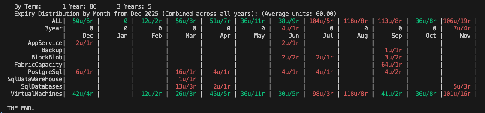

# reservation_plan

Azure reservation planning tool written in Rust

Retrieves Azure reservations using the Azure CLI and displays monthly distribution analysis.

## Setup

### Option 1: Use .env file (Recommended)

1. Copy `.env.example` to `.env`:
   ```bash
   cd reservation_plan
   cp .env.example .env
   ```

2. Edit `.env` and set your Azure Management subscription ID:
   ```
   MANAGEMENT_SUBSCRIPTION_ID=your-subscription-id-here
   ```
   
   You can get your subscription ID using:
   ```bash
   az account show --query id -o tsv
   ```

### Option 2: Use Azure CLI default (Fallback)

If no `.env` file is present, the tool will automatically use the currently active subscription from Azure CLI (`az account show`). This is convenient for quick usage but may not query the correct subscription if your reservations are billed under a different subscription (e.g., Management subscription).

## Usage

       cd reservation_plan
       cargo run --release

## Command-line Options

* `-h, --help` - Show help message
* `-f, --force, --refresh` - Force refresh from Azure (bypass cache)
* `--show-expired-reservations` - Include expired reservations in output

## Features

* Fetches all active Azure reservations via Azure CLI
* Retrieves monthly costs from Azure Cost Management API (previous complete month)
* Caches results in `cache_reservations_YYYYMM.json` for the current month
* Filters out expired and cancelled reservations by default
* Displays comprehensive summary statistics:
  * Total reservations and quantity (flex units)
  * Total monthly cost from Azure billing
  * Breakdown by resource type with monthly costs (e.g., VirtualMachines, PostgreSQL, etc.)
  * Per-VM-type cost breakdown
  * Breakdown by term (1 Year / 3 Years)
  * Monthly expiry distribution starting from current month
* Color-coded monthly distribution:
  * Green: below-average units (good months to add new reservations)
  * Red: above-average units (months to avoid adding more)
* Shows both overall totals and 3-year reservation distribution
* Per-service monthly breakdown with color-coded hotspots

## Output

The tool displays:
1. A detailed table of all active reservations
2. Summary statistics grouped by resource type, VM SKU, and term
3. Monthly expiry distribution table with color coding
4. Per-service monthly breakdown showing units/reservations (e.g., "10u/5r" = 10 units / 5 reservations)

### Example Output



**Legend:**
- Green cells: Below average (good months to add new reservations)
- Red cells: Above average (avoid adding more in these months)
- Format: `XXu/Yr` = XX units / Y reservations

## Requirements

* Azure CLI must be installed and authenticated
* Rust toolchain (cargo)
