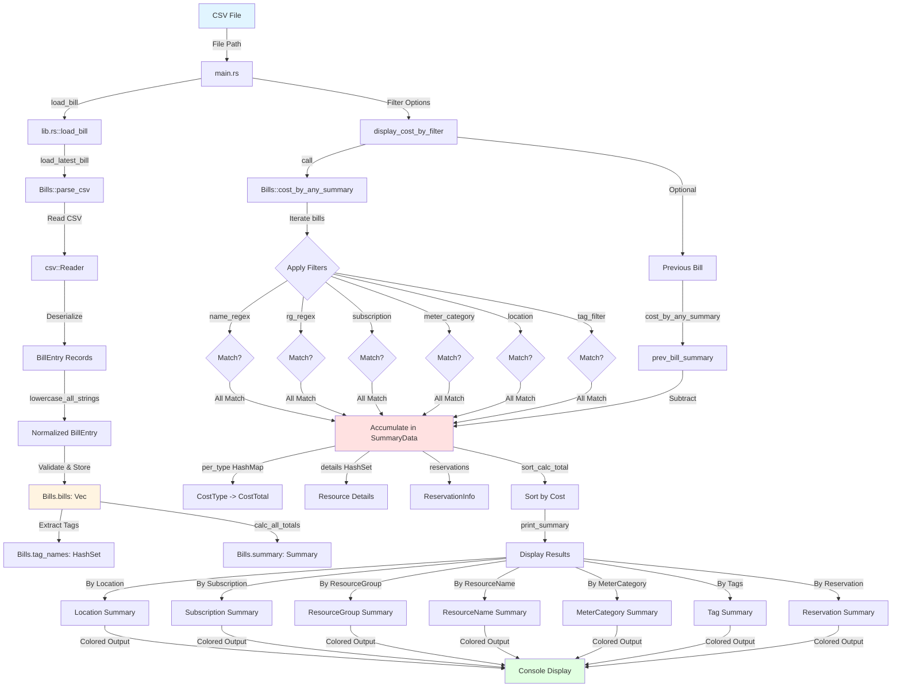

# Mermaid diagram 2025-12

```mermaid
flowchart TD
    A[CSV File] -->|File Path| B[main.rs]
    B -->|load_bill| C[lib.rs::load_bill]
    C -->|load_latest_bill| D[Bills::parse_csv]
    
    D -->|Read CSV| E[csv::Reader]
    E -->|Deserialize| F[BillEntry Records]
    
    F -->|lowercase_all_strings| G[Normalized BillEntry]
    G -->|Validate & Store| H[Bills.bills: Vec<BillEntry>]
    H -->|Extract Tags| I[Bills.tag_names: HashSet]
    
    H -->|calc_all_totals| J[Bills.summary: Summary]
    
    B -->|Filter Options| K[display_cost_by_filter]
    
    K -->|call| L[Bills::cost_by_any_summary]
    L -->|Iterate bills| M{Apply Filters}
    
    M -->|name_regex| N{Match?}
    M -->|rg_regex| O{Match?}
    M -->|subscription| P{Match?}
    M -->|meter_category| Q{Match?}
    M -->|location| R{Match?}
    M -->|tag_filter| S{Match?}
    
    N & O & P & Q & R & S -->|All Match| T[Accumulate in SummaryData]
    
    T -->|per_type HashMap| U[CostType -> CostTotal]
    T -->|details HashSet| V[Resource Details]
    T -->|reservations| W[ReservationInfo]
    
    K -->|Optional| X[Previous Bill]
    X -->|cost_by_any_summary| Y[prev_bill_summary]
    Y -->|Subtract| T
    
    T -->|sort_calc_total| Z[Sort by Cost]
    Z -->|print_summary| AA[Display Results]
    
    AA -->|By Location| AB[Location Summary]
    AA -->|By Subscription| AC[Subscription Summary]
    AA -->|By ResourceGroup| AD[ResourceGroup Summary]
    AA -->|By ResourceName| AE[ResourceName Summary]
    AA -->|By MeterCategory| AF[MeterCategory Summary]
    AA -->|By Tags| AG[Tag Summary]
    AA -->|By Reservation| AH[Reservation Summary]
    
    AB & AC & AD & AE & AF & AG & AH -->|Colored Output| AI[Console Display]
    
    style A fill:#e1f5ff
    style H fill:#fff4e1
    style T fill:#ffe1e1
    style AI fill:#e1ffe1
```